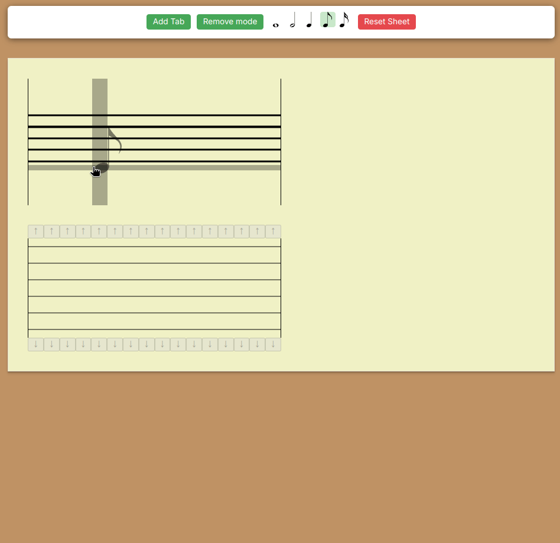

# notes-to-guitar-tabs

I've always found it difficult to translate sheet music to guitar tabs, so I created this web app to do it automatically. It generates all possible ways to play the provided notes, helping me find the most convenient fingerings without spending hours working through the translation manually

[try it out](https://notes-to-guitar-tabs.vercel.app/)

## Workflow
1. Place notes on a staff 
2. Get all possible tabulars
3. Select a tabular that you find more convinient
4. Save or Export

## Features
1. The app finds all possible solutions of how to play each chord and sorts them by ease of playing

## Future features
1. Export to pdf
2. Storage of pieces
3. Key selection
4. Guitar tuning change

